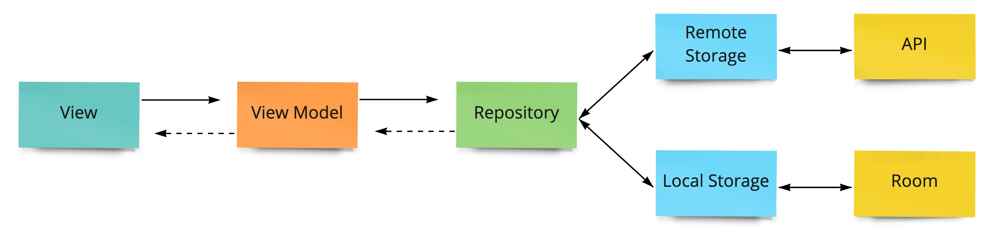
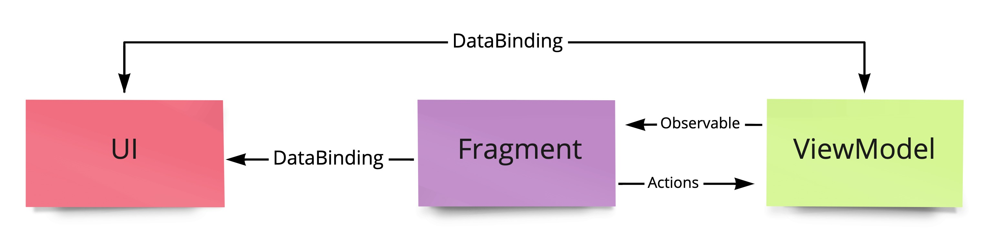

# An example of MVVM architecture for Android app.

<p align="center">

</p>

Language: **Kotlin**

Technology stack:
- Hilt
- DataBinding + LiveData
- RxJava3
- Room Database
- Retrofit2


**Example of data transfering between UI and ViewModel using MutableLiveData and SingleLiveEvent**

Here we can see how the ProgressBar change visibility depends on MutableLiveData in the ViewModel.
Also it's an example of user actions passing from Button view to the Fragment using SingleLiveEvent in the ViewModel.

>ViewModel:
```kotlin
class AppViewModel : ViewModel() {

    val showMessageEvent = SingleLiveEvent<String>()
    val isProgressBarVisible = MutableLiveData(false)
    
    fun showMessage(message: String) {
        showMessageEvent.postValue(message)
    }
    
    ...
}
```

>Fragment:
```kotlin
class AppFragment: Fragment() {

    private val viewModel: AppViewModel by viewModels()
    private lateinit var mBinding: ViewDataBinding

    override fun onCreateView(
        inflater: LayoutInflater,
        container: ViewGroup?,
        savedInstanceState: Bundle?
    ): View? {
        mBinding = DataBindingUtil.inflate(inflater, R.id.fragment_app, container, false)
        return mBinding.root
    }

    override fun onViewCreated(view: View, savedInstanceState: Bundle?) {
        super.onViewCreated(view, savedInstanceState)
        // Providing lifecycleOwner and ViewModel objects into DataBinding
        mBinding.lifecycleOwner = this
        mBinding.viewModel = viewModel
        
        viewModel.showMessageEvent.observe(viewLifecycleOwner) { message ->
            Toast.makeText(context, "message", Toast.LENGTH_LONG).show()
        }
    }   
   
    ...
}    
```

>fragment_app.xml:
```xml
<layout xmlns:android="http://schemas.android.com/apk/res/android"
    xmlns:app="http://schemas.android.com/apk/res-auto"
    xmlns:tools="http://schemas.android.com/tools">

    <data>

        <variable
            name="viewModel"
            type="AppViewModel" />

        <variable
            name="v"
            type="android.view.View" />

    </data>

    <androidx.constraintlayout.widget.ConstraintLayout
        android:id="@+id/cardinal"
        android:layout_width="match_parent"
        android:layout_height="match_parent">
      
        <ProgressBar
            android:id="@+id/progressBar"
            android:layout_width="50dp"
            android:layout_height="50dp"
            android:visibility="@{viewModel.isProgressBarVisible ? v.VISIBLE : v.GONE}"
            app:layout_constraintDimensionRatio="1:1"
            app:layout_constraintBottom_toBottomOf="parent"
            app:layout_constraintEnd_toEndOf="parent"
            app:layout_constraintStart_toStartOf="parent"
            app:layout_constraintTop_toTopOf="parent"
            tools:visibility="gone" />
      
        <Button
            android:id="@+id/buttonShowMessage"
            android:layout_width="wrap_content"
            android:layout_height="wrap_content"
            android:onClick="@{() -> viewModel.showMessage(@string/string_from_resources)}"
            app:layout_constraintBottom_toBottomOf="parent"
            app:layout_constraintEnd_toEndOf="parent"
            app:layout_constraintStart_toStartOf="parent" />
      
    </androidx.constraintlayout.widget.ConstraintLayout>

</layout>
```

<p align="center">

</p>

